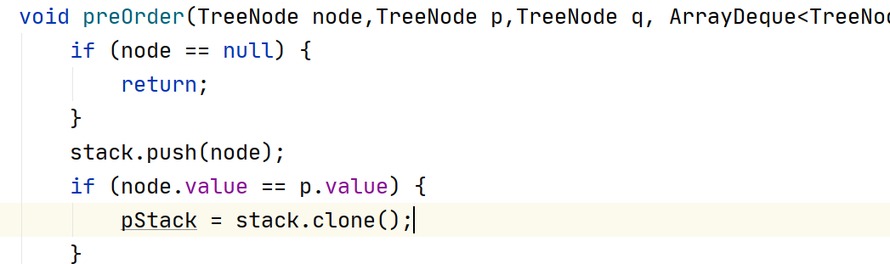

# 0.Java常用集合工具使用

## 0.1java中堆栈和队列的使用：直接使用双端队列——ArrayDeque

> ArrayDeque、ArrayList等之间可以使用构造方法互转。
>
> 原理就是数组拷贝。

同时具有栈、队列、双端队列全部接口，分别如下：

- Stack

| Modifier and Type | Method and Description                                       |
| ----------------- | ------------------------------------------------------------ |
| `boolean`         | `empty()`<br/>测试栈是否为空                                 |
| `E`               | `peek()` 在不将其从栈中移除的情况下，查看该栈顶部的对象。在栈为空的时候会报EmptyStackException |
| `E`               | `pop()`删除此栈顶部的对象，并将该对象作为此函数的值返回。在栈为空的时候会报EmptyStackException |
| `E`               | `push(E item)`<br/>将一个项目推送到此堆栈的顶部。            |
| `int`             | `push(E item)`<br/>将一个项目推送到此堆栈的顶部。            |

- Queue

| Modifier and Type | Method and Description                                       |
| ----------------- | ------------------------------------------------------------ |
| `boolean`         | `add(E e)`<br/>如果可以立即将指定的元素插入此队列，而不会违反容量限制，则在成功时返回true，如果当前没有可用空间，则抛出IllegalStateException。 |
| `E`               | `element()`<br/>检索但不删除此队列的头。                     |
| `boolean`         | `offer(E e)`<br/>如果可以在不违反容量限制的情况下立即将指定的元素插入此队列。 |
| E                 | `peek()`<br/>检索但不删除此队列的头部，如果此队列为空，则返回null。 |
| `E`               | `poll()`<br/>检索并删除此队列的头部，如果此队列为空，则返回null。 |
| `E`               | `remove()`<br/>检索并删除此队列的头。                        |

- Deque

  **First Element (Head)**：

  |             | *Throws exception*                                           | *Returns special value*                                      |
  | ----------- | ------------------------------------------------------------ | ------------------------------------------------------------ |
  | **Insert**  | [`addFirst(e)`](https://docs.oracle.com/javase/8/docs/api/java/util/Deque.html#addFirst-E-) | [`offerFirst(e)`](https://docs.oracle.com/javase/8/docs/api/java/util/Deque.html#offerFirst-E-) |
  | **Remove**  | [`addFirst(e)`](https://docs.oracle.com/javase/8/docs/api/java/util/Deque.html#addFirst-E-) | [`pollFirst()`](https://docs.oracle.com/javase/8/docs/api/java/util/Deque.html#pollFirst--) |
  | **Examine** | [`getFirst()`](https://docs.oracle.com/javase/8/docs/api/java/util/Deque.html#getFirst--) | [`peekFirst()`](https://docs.oracle.com/javase/8/docs/api/java/util/Deque.html#peekFirst--) |

  **Last Element (Tail)**

  |             | *Throws exception*                                           | *Returns special value*                                      |
  | ----------- | ------------------------------------------------------------ | ------------------------------------------------------------ |
  | **Insert**  | [`addLast(e)`](https://docs.oracle.com/javase/8/docs/api/java/util/Deque.html#addLast-E-) | [`offerLast(e)`](https://docs.oracle.com/javase/8/docs/api/java/util/Deque.html#offerLast-E-) |
  | **Remove**  | [`removeLast()`](https://docs.oracle.com/javase/8/docs/api/java/util/Deque.html#addFirst-E-) | [`pollLast()`](https://docs.oracle.com/javase/8/docs/api/java/util/Deque.html#pollFirst--) |
  | **Examine** | [`getLast()`](https://docs.oracle.com/javase/8/docs/api/java/util/Deque.html#getFirst--) | [`peekLast()`](https://docs.oracle.com/javase/8/docs/api/java/util/Deque.html#peekLast--) |

- PriorityQueue：优先队列即堆

  > 往优先队列加入元素时，会自动建堆

## 0.2关于使用HashSet对Object去重

> 当两个对象使用 `==`连接时，它会先调用两个对象的hashCode方法比较两个对象的hashCode是否相等（除了自带的Integer、String等已经重写过Object的hashCode方法的对象之外，默认都是不相等），再调用equals方法，当两者都满足时，才视为相等。所以当对自定义Object方法去重时，需要同时重写这两个方法。

## 0.3java中final修饰对象的传递问题

> java中方法参数中，对于final修饰的对象，传递不是原对象指针，而是其copy的指针。
>
> 这就导致Integer、String等对象，在传递时方法内部的修改无法对方法外部产生影响。

## 0.4Lambda表达式的使用

> Lambda表达式的使用必须要用到接口，能够简写的秘密在于这个接口里面的方法很少，通过参数类型或者参数个数能锁定到那个方法，lambda表达式实质为实现了接口中的方法。
>
> Lambda表达式便捷在于，接口无需指定，当方法的参数约束为某个接口时，会自动匹配到那个接口。

`::`的使用

使用::可以指定引用方法，是当lambda表达式中恰好只需调用这个方法的简写。例如：

```java
public class Example {

	@Test
	public void test() {
		InterfaceExample com =  Example::new;
        //等效于
        InterfaceExample com = (i) -> new Integer(i);
		Example bean = com.create();	
		System.out.println(bean);
	}
}

interface InterfaceExample{
	Example create();
}
```

```java
//用法一
int[] ints = Arrays.stream(integers).mapToInt(Integer::valueOf).toArray();
//用法二
Integer[] integers = Stream.iterate(1, (a) -> a + 1).limit(50).toArray(Integer[]::new);

```

## 0.5妖魔鬼怪

使用克隆的栈，在递归退栈的时候竟然给我清空了。



> 问题解决：java中没有指针，引用类型传参是传递永远是对象或数组的地址，而不是指针。即传递的是箭头的终点，而不是箭头的始端。
>

## 0.6数组初始化

```java
int[]dp=new int[amount]
Arrays.fill(dp, -1);
```

# 1.贪心

## 定义

> 遵循某种规律，不断**贪心**地选取**当前最优**策略的算法设计方法

## 例题

- ### 糖果分配：给定一个糖果大小序列和一个需求序列，求最大满足的需求数

  ```java
  package com.zwj;
  import java.util.*;
  /**
   * @Author:zengwenjie
   * @Date:2021/2/28 16:32
   */
  public class Sweet_allocation {
      public static void main(String[] args) {
          List<Integer> sweet = Arrays.asList(20,8,3,1,6);
          List<Integer> need = Arrays.asList(15,5,9,2,10,9);
          long start = System.currentTimeMillis();
          System.out.println("糖果大小分别为"+"-----"+sweet);
          System.out.println("需求因子分别为"+"-----"+need);
          int num = new Sweet_allocation().sweet_allocation(sweet, need);
          System.out.println("最后能满足的个数"+"-----"+num);
          long last = System.currentTimeMillis();
          System.out.println("程序执行时间为"+(last-start)+"ms");
      }
      public int sweet_allocation(List<Integer> sweet, List<Integer> need) {
          Comparator comparator = new Comparator() {
              @Override
              public int compare(Object o1, Object o2) {
                  return (int) o1 - (int) o2;
              }
          };
          sweet.sort(comparator);
          need.sort(comparator);
          int s_size = sweet.size();
          int n_size = need.size();
          int s = 0,n =0;
          while (s < s_size && n < n_size) {
              if (((int) need.get(n)) <= ((int) sweet.get(s))) {
                  n++;
              }
                  s++;
          }
          return n;
      }
  }
  ```

  

  

- ### 摆动数组：给定一个数组，求最长摆动子序列

  

```java
package com.zwj;
import java.util.ArrayList;
import java.util.Arrays;
import java.util.List;
/**
 * @Author:zengwenjie
 * @Date:2021/2/28 18:53
 */
public class WiggleMaxLength {
    static final int STATIC = 0;
    static final int UP = 1;
    static final int DOWN = 2;
    public static void main(String[] args) {
        long start = System.currentTimeMillis();
        int[] array = {1,17,5,10,13,15,10,5,16,8};
        ArrayList<Integer> list = new ArrayList<>();
        System.out.println("输入的序列为："+"-----"+ Arrays.toString(array));
        int result = new WiggleMaxLength().solution(array,list);
        System.out.println("最长摆动子序列长度为" +list.size());
        System.out.println("最长摆动子序列为："+"-----"+list.toString());
        long end = System.currentTimeMillis();
        System.out.println("程序运行时间" +
                "-----"+(start-end)+"ms");


    }

    public int solution(int [] array, List<Integer> list) {
        //开始状态设置设为 不变
        int state = STATIC;
        int maxLength = 1;
        list.add(array[0]);
//      从第二位元素开始遍历，比较与前一个元素的大小修改状态
        for (int i = 1; i < array.length; i++) {
            switch (state) {
                case STATIC:
                    if (array[i - 1] < array[i]) {
                        state = UP;
                        maxLength++;
                        list.add(array[i]);
                    } else if (array[i - 1] > array[i]) {
                        state = DOWN;
                        maxLength++;
                        list.add(array[i]);
                    }
                    break;

                case UP:
                    if (array[i - 1] < array[i]) {
                        //如果一直增加，则移除上次加入list的数，再加入当前这个更大的数，
                        //保证最后加入摆动子序列是一直递增得到最大的那个数
                        list.remove(list.size() - 1);
                        list.add(array[i]);
                    } else if (array[i - 1] > array[i]) {
                        state = DOWN;
                        maxLength++;
                        list.add(array[i]);
                    }
                    break;
                case DOWN:
                    if (array[i - 1] < array[i]) {
                        state = UP;
                        maxLength++;
                        list.add(array[i]);
                    } else if (array[i - 1] > array[i]) {
                        //如果一直减少，则移除上次加入list的数，再加入当前这个更小的数，
                        //保证最后加入摆动子序列是一直递减得到最小的那个数
                        list.remove(list.size() - 1);
                        list.add(array[i]);
                    }
                    break;
            }
        }
        return maxLength;
    }
```


# 2.递归

> 把一个大型复杂的问题层层转化为一个与原问题相似的规模较小的问题来求解的思想

# 3.回溯

> 回溯法又称为试探法，但当探索到第一步时，发现原先的选择达不到目标，就退回一步重新选择，这种走不通就退回再走的思想成为回溯法。

# 4.二叉树

> 层序遍历记录高度的两种方法：
>
> 1. 根节点的高度为0，每一次循环（弹出结点，加入该结点的结点）在加入结点的同时，把当前结点高度+1绑定给新加入节点。*使用键值对把结点和高度绑定*
>
> 2. 第一次循环时，队列只含有一个结点，执行一次循环后得到恰好是第二层的所有结点。
>
>    如果在循环之前记录队列的个数size，就知道在执行size次循环后恰好是下一层的所有结点。
>
>    由此类推。

# 5.图

### 5.1环的判断

1. 使用深搜，但是对visited数组修改为三种状态，深搜第一步先把当前结点的状态设置为`正在遍历`，每次对临接结点深搜之前，如果该结点的状态是`正在遍历`说明遇到了未搜索完退栈的结点，即出现环路，返回false。

2. 使用广搜，邻接表进行拓扑排序是不方便对图的入度进行判断，一般会先准备好入度数组，从入读为0的结点开始进行广搜。若最后结点存在未访问结点，即有环。

   > 广搜也可用三种状态标记，因为可能会出现一个结点被多次添加到队列的情况。

## 5.2使用广搜得到单源最短路径（距离相同要求返回多条结果）

> 遇到最短路径问题是时，往往需要准备一个数组（初始值为-1）记录搜索路径下所有结点的距离始点的距离，当临接点的距离大于所记录的距离不对该临界点进行搜索。
>
> 这样处理既避免了环路的问题。

# 6.动态规划

## 6.1动态规划基础

- 动态规划是运筹学的一个分支，是求解决策过程最优化的数学方法。它是20世界50年代初美国数学家R.E.Bellman等人提出的最优化原理，它利用各阶段之间的关系，逐个求解，最终求得全局最优解。在设计动态规划算法时，需要确认原问题和子问题，动态规划状态，边界状态值，状态转移方程等关键因素。

> 动态规划的状态转移方程不一定是连续的，方程的左边也可能出现很多个状态。
>
> 一个状态也可能需要保存多个值。	

## 例题：

1. 你是一个专业的小偷，计划偷窃沿街的房屋。每间房内都藏有一定的现金，影响你偷窃的唯一制约因素就是相邻的房屋装有相互连通的防盗系统，如果两间相邻的房屋在同一晚上被小偷闯入，系统会自动报警。

   给定一个代表每个房屋存放金额的非负整数数组，计算你 不触动警报装置的情况下 ，一夜之内能够偷窃到的最高金额。

   > 输入：[1,2,3,1]
   > 输出：4
   > 解释：偷窃 1 号房屋 (金额 = 1) ，然后偷窃 3 号房屋 (金额 = 3)。
   >      偷窃到的最高金额 = 1 + 3 = 4 。

   dp[i]=Max{dp[i-1]),dp[i-2]+nums[i]}

2. 假设你正在爬楼梯。需要 *n* 阶你才能到达楼顶。

   每次你可以爬 1 或 2 个台阶。你有多少种不同的方法可以爬到楼顶呢？

   **注意：**给定 *n* 是一个正整数。

   > 输入： 2
   > 输出： 2
   > 解释： 有两种方法可以爬到楼顶。
   > 1.  1 阶 + 1 阶
   > 2.  2 阶

   状态方程：

   dp[i]=`dp[i-1]`+`dp[i-2]`

3. 给定不同面额的硬币 coins 和一个总金额 amount。编写一个函数来计算可以凑成总金额所需的最少的硬币个数。如果没有任何一种硬币组合能组成总金额，返回 -1。

   你可以认为每种硬币的数量是无限的

   > 输入：coins = [1, 2, 5], amount = 11
   > 输出：3 
   > 解释：11 = 5 + 5 + 1

   状态方程：

   设金额数组，int dp [amount]

   dp[i]=Min{`dp[i-coins[0]]`,`dp[i-coins[1]]`,`dp[i-coins[2]]`...}+1